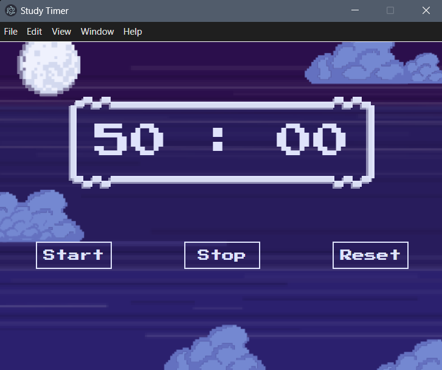
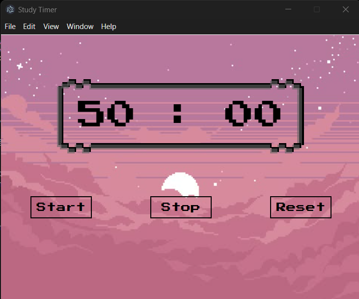
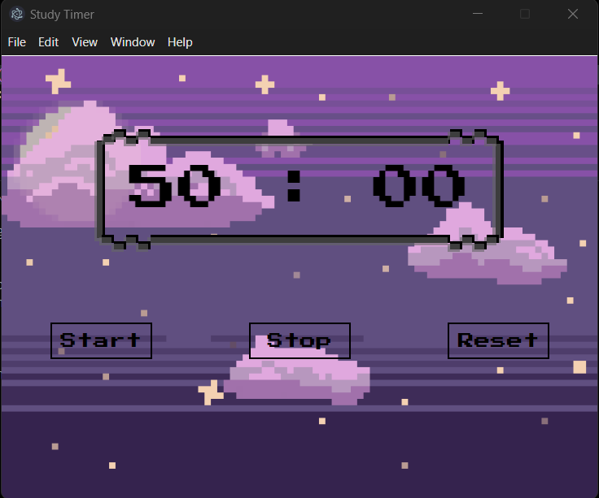

# Study Timer

Study Timer is a small pixel style countdown timer desktop application built using Electron.js, HTML, CSS, and JavaScript. This application provides a 50-minute timer to help users focus on their study sessions with start, stop, and reset functionalities.

## Features
    1. 50-minute countdown timer
    2. Start, Stop, and Reset functionalities
    3. Pixel-art styled UI

Since it's built using Electron.js it provides a desktop app experience.

## Installation

**Prerequisites**
* Node.js installed
* Electron.js installed

**Steps**
1. Clone the repository
        ```git clone https://github.com/niharikapatil2306/Study-Timer.git```
        ```cd Study-Timer```
2. Install dependencies
        ```npm install```
3. Run the application
        ```npm start```

## Enabling Live Reload
To enable live changes while editing the code, you can uncomment the lines below in main.js:

```// require('electron-reload')(path.join(__dirname), { electron: path.oin(__dirname, 'node_modules', '.bin', 'electron')});```

Also ensure that ```electron-reload``` is installed, if not then run the following command: 
    ```npm install electron-reload --save-dev```

## Packaging as an Executable (for Windows)
You can package this application as an executable using Electron Packager.

Comment the reload lines before running these steps!!

**Steps**
1. Install Electron Packager globally: ```npm install -g electron-packager```
2. Run the following command to create a Window executable: ```electron-packager . StudyTimer --platform=win32 --arch=x64 --out=dist/ --overwrite```
3. The executable can be found in the ```dist/``` folder.





